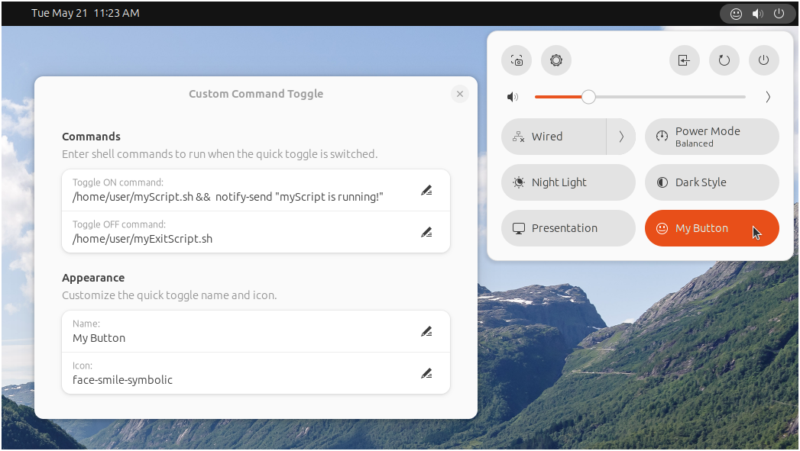

# Custom Command Toggle

#### A GNOME extension to run shell commands using a GNOME quick toggle.

Custom Command Toggle is a GNOME extension to run user defined terminal/shell commands by switching a customizable quick toggle button on or off.

 

 

## Features:

- Run terminal commands and launch custom scripts using a quick toggle button.
- Easily change the quick toggle button name and icon in the extension preferences.
- Enter separate commands to run when the quick toggle is switched on and when it is switched off.

 

## Installation

Browse for and install this extension through the GNOME Extension tool, or install through the [GNOME Extensions website](https://extensions.gnome.org/extension/7012/custom-command-toggle/).

OR

Manual Installation:

1. Download the  custom-command-toggle.zip file of the [latest release](https://github.com/StorageB/custom-command-toggle/releases/tag/v2). 
2. Run the following command from the terminal:
`gnome-extensions install --force custom-command-toggle.zip`
3. Logout and login.

 

## Configuration

Customize the behavior and appearance of the quick toggle by accessing the extension preferences.

### Appearance

Enter the text and icon information to use for the quick toggle button. 

For a list of available icons, navigate to icon directory on your computer at `/usr/share/icons/Adwaita/scalable`. Enter the file name of the icon you wish to use (without the file extension) in the "Icon" field.

### Commands

Enter the terminal/shell commands to associate with the quick toggle on/off actions.

Tips:
- Chain multiple commands together using `&&` between commands.
- Test the command first by running it in the terminal before adding it to the extension to verify it is correct. Note that because the command is not running in a terminal window, there will not be any output or error messages.

 

## Usage Examples and Suggestions

Here are some ideas on how this extension can be used:
- Create a work/home mode toggle that automatically launches all the applications and web pages you need opened.
- Use the quick toggle to launch custom bash scripts or python scripts. 
- Create a presentation or streaming mode toggle that sets up your computer for presentations or for streaming video on an HDMI connected TV. You could input commands to do the following:
    - Turn off night light for presentation mode.
    - Enable do not disturb to disable popup notifications for presentation mode.
    - Change sound output to HDMI for presentation mode.
    - Switch back to defaults when presentation mode is disabled.

 

## Contributing

Contributions are welcome! Feel free to open an issue or submit a pull request to contribute to this project.
 

## License

This project is licensed under the [GNU General Public License](http://www.gnu.org/licenses/).

 

#### I hope you found this extension helpful!

