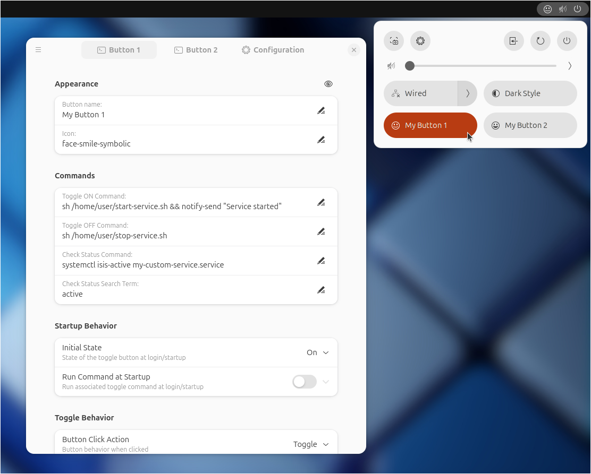

# Custom Command Toggle

#### A GNOME extension to create custom quick toggle buttons.

Custom Command Toggle is an extension for GNOME 45+ that lets you create fully customizable quick toggle buttons in the system menu.

<br>



<br>

## Features:

- Run commands or launch scripts directly from GNOME Quick Toggle buttons
- Smart startup behavior (auto-detect, restore previous state, or manually set on/off)
- Optional command-based state syncing
- Customize button names and icons (with a quick-reference icon list in the User Guide)
- Assign keyboard shortcuts to buttons
- Import and export button configurations
- Create up to 6 independent custom toggle buttons

<br>

## Documentation

For detailed configuration instructions and setup tips, refer to the  

### 📘 [User Guide](https://StorageB.github.io/custom-command-toggle/)

<br>

## Installation

### Recommended Installation

Browse for and install this extension through the GNOME Extension Manager, or install through the [GNOME Extensions website](https://extensions.gnome.org/extension/7012/custom-command-toggle/).


### Manual Installation

1. Download the `custom-command-toggle.zip` file of the [latest release](https://github.com/StorageB/custom-command-toggle/releases). 
2. In the terminal run:
`gnome-extensions install --force custom-command-toggle.zip`
3. Logout and login.

To enable and configure the extension:
```
gnome-extensions enable custom-command-toggle@storageb.github.com
gnome-extensions prefs custom-command-toggle@storageb.github.com
```


