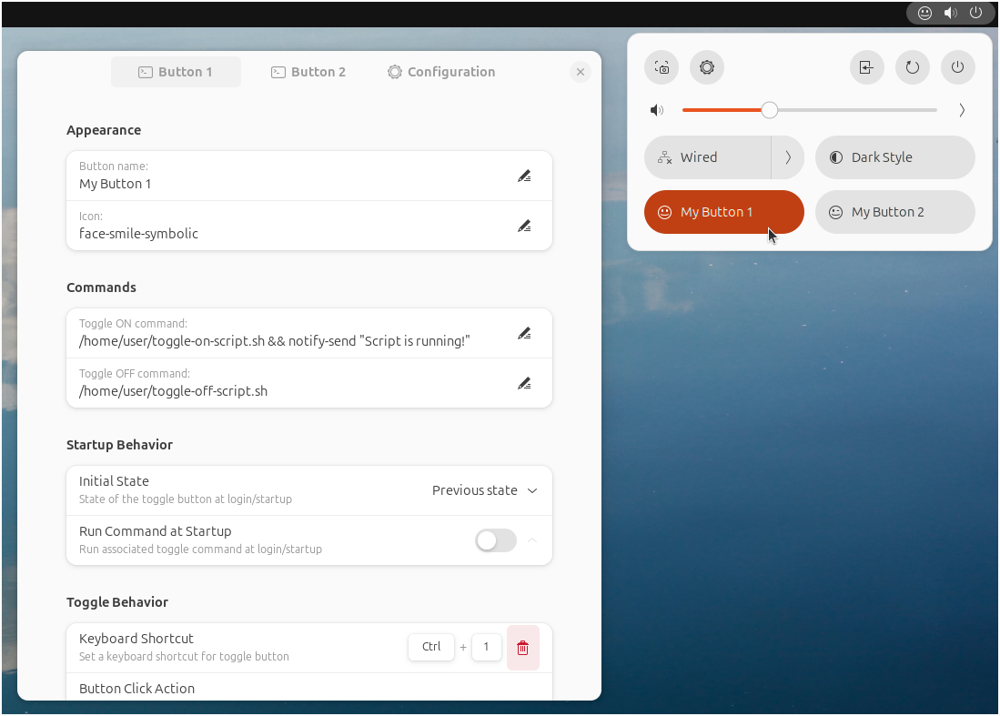
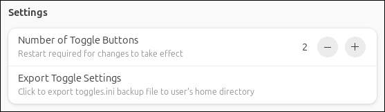
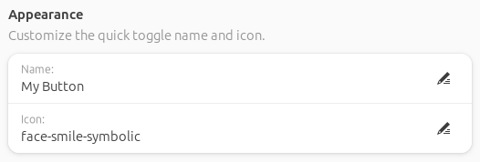
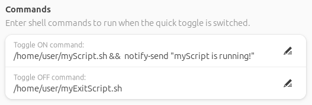
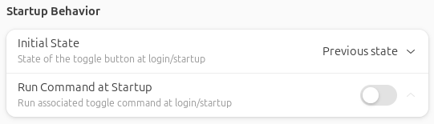
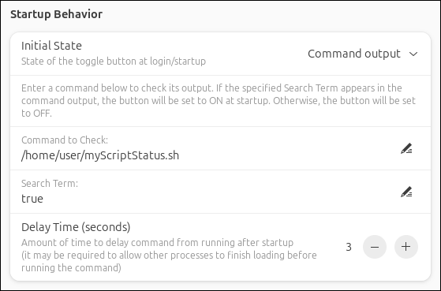
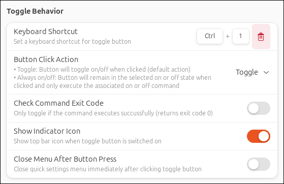

# Custom Command Toggle

#### A GNOME extension to create custom quick toggle buttons.

Custom Command Toggle is an extension for GNOME 45/46/47/48 to create fully customizable quick toggle buttons.

 

 

## Features:

- Run terminal commands and launch custom scripts using quick toggle buttons.
- Assign custom button names and icons.
- Enter separate commands to run when the button is switched on and when it is switched off.
- Run a command at startup to determine the button's initial state based on the command output, or manually specify whether the button starts as on, off, or in its last known state.
- Run associated on or off command at startup to sync button state if required.
- Option to toggle the button only if the command executes successfully and returns exit code 0 (for use with sudo commands using `pkexec sudo` where the command could be canceled or incorrect password entered).
- Customize toggle button behavior to toggle or be in an always on or off state.
- Assign keyboard shortcuts to quick toggle buttons.
- Create up to 6 custom buttons.

 

## Installation

### Recommended

Browse for and install this extension through the GNOME Extension Manager, or install through the [GNOME Extensions website](https://extensions.gnome.org/extension/7012/custom-command-toggle/).

### Manual

1. Download the `custom-command-toggle.zip` file of the [latest release](https://github.com/StorageB/custom-command-toggle/releases). 
2. Run the following command from the terminal:
`gnome-extensions install --force custom-command-toggle.zip`
3. Logout and login.

 

## Configuration

### General Settings

In the Configuration tab under Settings, select the number of toggle buttons to create (maximum of 6). Note that this requires logging off/on or rebooting for changes to take effect.

There is also an option to export the current configuration for all the toggle buttons to a file for backup purposes. 

 

### Appearance

Enter the name and icon information to use for the quick toggle button. 

For a list of available symbolic icons to use refer to:
[GNOME default icons](https://github.com/StorageB/icons/blob/main/GNOME46Adwaita/icons.md) or
[Ubuntu Yaru icons](https://github.com/StorageB/icons/blob/main/Yaru/icons.md)

Alternatively, navigate to the icon directory for your system’s theme (located at /usr/share/icons), or use the [Icon Library app](https://flathub.org/apps/org.gnome.design.IconLibrary).

Enter the name of the icon without the file extension. Note that icon appearance will vary depending on your system's theme.

 

### Commands

Enter the terminal/shell commands to associate with the quick toggle on/off actions.

Tips:
- Run multiple commands by using `&` between commands.
- Chain multiple commands together to run one at a time using `&&` between commands.
- By default, commands do not run in a terminal window and will not show any output or error messages. Test the full command first by running it in the terminal before adding it to the extension to verify it is correct. 
- To run a command in a terminal window, use `gnome-terminal -- command`. Note that by default the GNOME terminal will close after the command is complete, but that can be changed in the terminal preferences if needed.
- For sudo commands that require a password, use `pkexec` before the command to get a password prompt. For example, `pkexec sudo command` will prompt for your password and then run the command. Alternatively, you can use `gnome-terminal -- sudo command` to open a terminal where you can enter your password.

 

### Startup Behavior

Specify the state of each toggle button at startup (on, off, the previous state it was in, or check a command's output to determine the state), and select if you want that command to run at startup to sync to the selected toggle state.

If "Run Command at Startup" is selected, there is an option to specify a delay time before the command is executed. Because GNOME extensions load early in the startup process, it may be required to delay your command from running by a few seconds to allow other processes to finish loading first. If this is not required, set the delay to 0.

If "Command output" is selected as the Initial State, Enter a command to check its output. If the specified Search Term appears in the command output, the button will be set to ON at startup. Otherwise, the button will be OFF at startup.

 

### Toggle Behavior

Assign keyboard shortcuts for each button, and specify how the button and menu behave when the button is clicked.

If using `pkexec` or `gnome-terminal -- command` to run sudo commands, it is recommended to enable Check Command Exit Code so that if an incorrect password is entered or the command is canceled, the button will not toggle if the command does not run.

 

## License

This project is licensed under the [GNU General Public License](http://www.gnu.org/licenses/).

 

#### I hope you found this extension useful!

