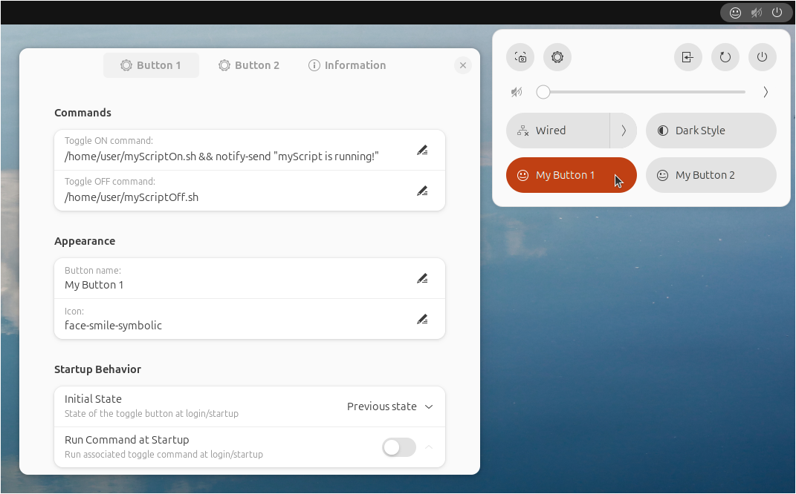
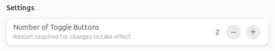

# Custom Command Toggle

#### A GNOME extension to run commands using a GNOME quick toggle.

Custom Command Toggle is an extension for GNOME 45/46/47 to run user-defined commands by switching a customizable quick toggle button on or off.

 

 

## Features:

- Run terminal commands and launch custom scripts using quick toggle buttons.
- Easily change the button name and icon in the extension preferences.
- Enter separate commands to run when the button is switched on and when it is switched off.
- Specify the state of the buttons at startup (on, off, or remember the last state it was in)
- Run associated command at startup to match button state if required.
- Customize toggle button behavior to toggle or be in an always on or off state.
- Assign keyboard shortcuts to quick toggle buttons
- Create up to 6 custom buttons.

 

## Installation

<!--
### Recommended
-->

Browse for and install this extension through the GNOME Extension tool, or install through the [GNOME Extensions website](https://extensions.gnome.org/extension/7012/custom-command-toggle/).

<!--
### Manual

1. Download the `custom-command-toggle.zip` file of the [latest release](https://github.com/StorageB/custom-command-toggle/releases). 
2. Run the following command from the terminal:
`gnome-extensions install --force custom-command-toggle.zip`
3. Logout and login.
-->

 

## Configuration

### Number of Buttons

In the Information tab under Settings, select the number of toggle buttons to create (maximum of 6). Note that this requires logging off/on or rebooting for changes to take effect.

 

### Commands

Enter the terminal/shell commands to associate with the quick toggle on/off actions.

Tips:
- Run multiple commands by using `&` between commands.
- Chain multiple commands together to run one at a time using `&&` between commands.
- By default, commands do not run in a terminal window and will not show any output or error messages. Test the full command first by running it in the terminal before adding it to the extension to verify it is correct. 
- To run a command in a terminal window, use `gnome-terminal -- command`. Note that by default the GNOME terminal will close after the command is complete, but that can be changed in the terminal preferences if needed.
- Sudo commands require a password input from the terminal, so they will not directly work by themselves since commands run without a terminal window by default. However, you can use `gnome-terminal -- command` to run the command in the terminal. For example, `gnome-terminal -- sudo apt-get update` will open a terminal, prompt for your password, and then run the command.

 

### Appearance

Enter the text and icon information to use for the quick toggle button. 

For a list of available symbolic icons to use refer to:
[GNOME default icons](https://github.com/StorageB/icons/blob/main/GNOME46Adwaita/icons.md) or
[Ubuntu Yaru icons](https://github.com/StorageB/icons/blob/main/Yaru/icons.md)

Alternatively, navigate to the icon directory for your system’s theme (located at /usr/share/icons), or use the [Icon Library app](https://flathub.org/apps/org.gnome.design.IconLibrary).

Enter the name of the icon without the file extension. Note that icon appearance will vary depending on your systems's theme.

 

### Startup Behavior

Specify the state of the toggle button at startup (on, off, or to remember the previous state it was in), and select if you want that command to run at startup.

If Run Command at Startup is selected, there is an option to specify a delay time before the command is executed. Because GNOME extensions load early in the startup process, it may be required to delay your command from running by a few seconds to allow other processes to finish loading first. If this is not required, set the delay to 0.

 

## License

This project is licensed under the [GNU General Public License](http://www.gnu.org/licenses/).

 

#### I hope you found this extension useful!

