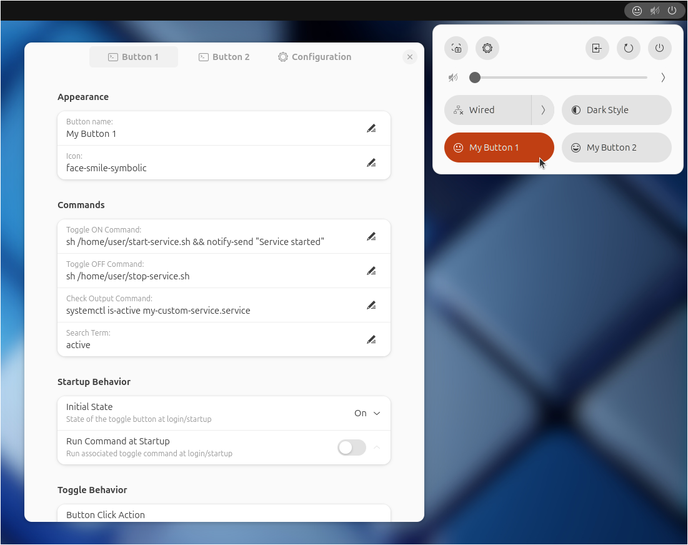
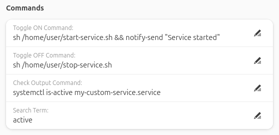
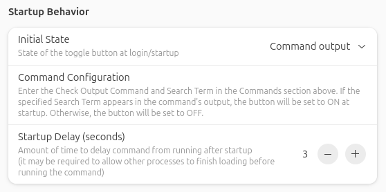
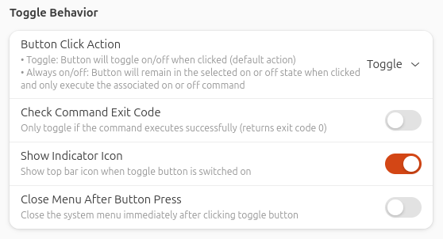
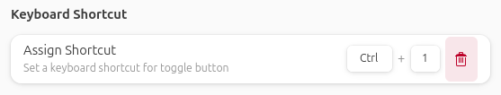
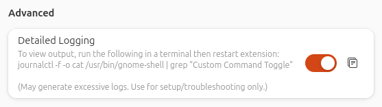

# Custom Command Toggle

#### A GNOME extension to create custom quick toggle buttons.

Custom Command Toggle is an extension for GNOME 45/46/47/48 to create fully customizable quick toggle buttons.

<br>



<br>

## Features:

- Run commands and launch custom scripts using quick toggle buttons.
- Assign custom button names and icons.
- Run a command at startup to determine the button's initial state based on the command output, or manually specify whether the button starts as on, off, or in its last known state.
- Run associated on or off command at startup to sync button state if required.
- Keep button states synced to a command's output.
- Option to toggle the button only if the command executes successfully and returns exit code 0 (for use with sudo commands using `pkexec sudo` where the command could be canceled or incorrect password entered).
- Customize toggle button behavior to toggle or be in an always on or off state.
- Assign keyboard shortcuts to quick toggle buttons.
- Create up to 6 custom buttons.

<br>

## Installation


### Recommended


Browse for and install this extension through the GNOME Extension Manager, or install through the [GNOME Extensions website](https://extensions.gnome.org/extension/7012/custom-command-toggle/).


### Manual

1. Download the `custom-command-toggle.zip` file of the [latest release](https://github.com/StorageB/custom-command-toggle/releases). 
2. In the terminal run:
`gnome-extensions install --force custom-command-toggle.zip`
3. Logout and login.

To enable and configure the extension:
```
gnome-extensions enable custom-command-toggle@storageb.github.com
gnome-extensions prefs custom-command-toggle@storageb.github.com
```

<br>

## Configuration

Open the extension preferences via the Extension Manager or run
`gnome-extensions prefs custom-command-toggle@storageb.github.com`

### General Settings

In the Configuration tab under Settings, select the number of toggle buttons to create (maximum of 6). Note that this requires logging off/on or rebooting for changes to take effect.

There is also an option to export the current configuration for all the toggle buttons to a file for backup purposes. 


<br>

### Icons

Enter the button name and icon information for each toggle button. 


**For a list of available symbolic icons to use refer to:**
- [GNOME default icons](https://github.com/StorageB/icons/blob/main/GNOME48Adwaita/icons.md)
- [Ubuntu Yaru icons](https://github.com/StorageB/icons/blob/main/Yaru/icons.md)

Alternatively, browse the icon directory for your system’s theme (typically /usr/share/icons) and enter the name of an icon (without the file extension).

To use a custom icon, place the icon in: `~/.local/share/icons/`. Reboot and then enter the icon name (without the file extension). 

To use separate on/off icons, enter both icon names separated by a comma.

<br>

### Commands

Enter the terminal/shell commands to associate with the quick toggle on/off actions.



Command tips:
- Run multiple commands in parallel by using `&` between commands.
- Run multiple commands one at a time using `&&` between commands.
- Commands run silently (no terminal output), so test them in a terminal before using. 
- To run a command in a terminal window, use `gnome-terminal -- command`. Note that by default the GNOME terminal will close after the command is complete, but that can be changed in the terminal preferences if needed.
- For sudo commands that require a password, use `pkexec` before the command to get a password prompt. For example, `pkexec sudo command` prompts for your password and then runs the command. Alternatively, use `gnome-terminal -- sudo command` to open a terminal where you can enter your password.
- To open the command configuration window for this extension directly, use the command `gnome-extensions prefs custom-command-toggle@storageb.github.com`.

<br>


### Startup Behavior

Specify the state of each toggle button at startup (on, off, the previous state it was in, or check a command's output to determine the state), and select if you want that command to run at startup to sync to the selected toggle state.


If "Run Command at Startup" is selected, there is an option to specify a delay time before the command is executed. Because GNOME extensions load early in the startup process, it may be required to delay your command from running by a few seconds to allow other processes to finish loading first. If this is not required, set the delay to 0.

If "Command output" is selected as the Initial State, enter a command to check its output. If the specified Search Term appears in the command output, the button will be set to ON at startup. Otherwise, the button will be OFF at startup.

Enable "Keep Toggle State Synced" to periodically check the output of a command and update the button state accordingly. Set "Polling Frequency" to specify how often the command should run in the background. 




<br>

### Toggle Behavior

Specify how the button and menu behave when the button is clicked.



If using `pkexec` or `gnome-terminal -- command` to run sudo commands, it is recommended to enable Check Command Exit Code so that if an incorrect password is entered or the command is canceled, the button will not toggle if the command does not run.

<br>

### Keyboard Shortcuts

Assign keyboard shortcuts to toggle buttons.



<br>

### Advanced 

In the Configuration tab under Advanced, enable "Detailed Logging" to view extension and command output for toggle button and command sync setup and troubleshooting purposes. Run the following command in a terminal to view the output (click the copy button to copy the command):

`journalctl -f -o cat /usr/bin/gnome-shell | grep "Custom Command Toggle"`



Caution: Use detailed logging only for troubleshooting purposes. Leaving this option enabled could result in continuous excessive logging.

<br>


## License

This project is licensed under the [GNU General Public License](http://www.gnu.org/licenses/).

<br>

#### I hope you found this extension useful!

<a href="https://www.buymeacoffee.com/StorageB" target="_blank"></a>


