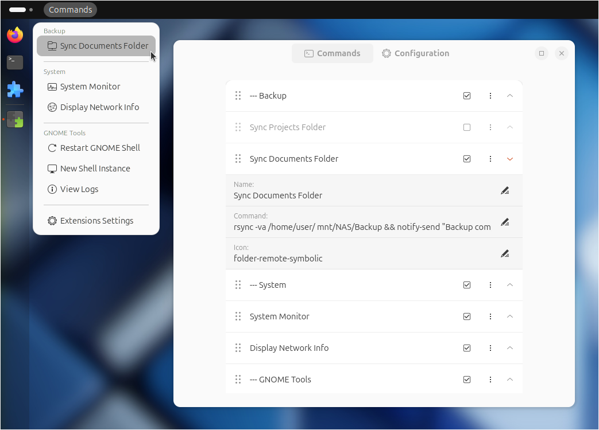

<!-- about.md -->

## Links

GitHub page:

[https://github.com/StorageB/custom-command-toggle](https://github.com/StorageB/custom-command-toggle)

GNOME extension page:

[https://extensions.gnome.org/extension/7012/custom-command-toggle/](https://extensions.gnome.org/extension/7012/custom-command-toggle/)

Icon repository:

[https://github.com/StorageB/icons](https://github.com/StorageB/icons)

Discussion:

[https://github.com/StorageB/custom-command-toggle/discussions](https://github.com/StorageB/custom-command-toggle/discussions)

## License

This project is licensed under the [GNU General Public License](http://www.gnu.org/licenses/).

---

## Other Extensions

**Custom Command Menu**

Run commands from a custom drop-down menu!

[Custom Command Menu](https://extensions.gnome.org/extension/7024/custom-command-list/) is an extension for GNOME 45+ to run user-defined commands from a customizable drop-down menu at the top bar.

---

