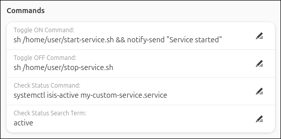
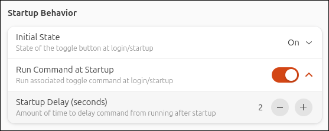
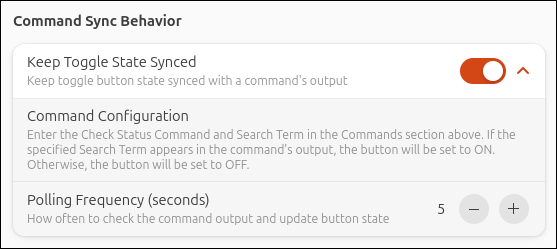
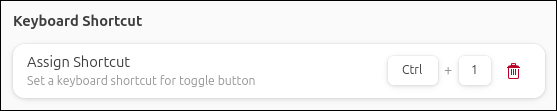
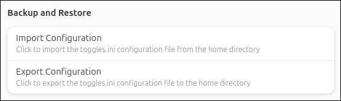

<!-- config.md -->

To set up and configure, open the extension preferences via the Extension Manager or run:


```
gnome-extensions prefs custom-command-toggle@storageb.github.com
```

---

## Appearance

Enter the _Button name_ and _Icon_ to use for each button. Refer to the Icons section below for additional information.

To temporarily remove a toggle button without deleting its configuration, use the hide/reveal button at the top of the Appearance section. Hidden toggles do not appear in the quick settings menu and are fully disabled while hidden.


---

## Icons

Enter the icon name for each toggle button. <!--This extension uses GNOME symbolic icons by default that will display the correct size and use the correct color based on your system's theme. Enter the icon name only – -->Do not use the icon path or include a file extension.

<u>**Available Icons**</u>

For a list of available symbolic icons to use refer to:

- [GNOME default icons](icons-adwaita.md)
- [Ubuntu Yaru icons](icons-yaru.md)

Alternatively, browse the icon directory for your system’s theme (typically `/usr/share/icons`) and enter the name of an icon (without the file extension).

<u>**Custom Icons**</u>

To use a custom icon, place the icon in: `~/.local/share/icons/`. Reboot and then enter the icon name (without the file extension). 

<u>**Seprate On/Off Icons**</u>

To display different icons when the toggle button is on and off, enter both icon names separated by a comma.

---

## Commands

Enter the commands to associate with the quick toggle on/off actions. 

If using the _Command output_ option for the _Initial State_ setting or the _Keep Toggle State Synced_ setting, enter the _Check Status Command_ and _Search Term_ to be used. Refer to the [Startup Behavior](#startup-behavior) and [Command Sync Behavior](#command-sync-behavior) sections for more details.



**Command tips:**

- Run multiple commands in parallel by using `&` between commands.
- Run multiple commands one at a time by using `&&` between commands. 
- Commands run silently (no terminal output), so test them in a terminal before using. 
- To run a command in a terminal window, use `gnome-terminal -- command`. Note that by default the GNOME terminal will close immediately after the command is complete, but that can be changed in the terminal preferences if needed.

**sudo Commands:**

- Use `pkexec` before the command to prompt for a password. For example, `pkexec sudo command` prompts for your password and then runs the command. Alternatively, use `gnome-terminal -- sudo command` to open a terminal where you can enter your password.
- Enable the _Check Command Exit Code_ option under [Toggle Behaviour](#toggle-behavior) for sudo commands. This will prevent the toggle button from changing status if the wrong password is entered or the command is canceled.

---

## Startup Behavior

Specify the state of each toggle button at startup:

- **On**: Toggle will be on at startup
- **Off**: Toggle will be off at startup
- **Previous state**: Toggle will be in the state it was previously in at startup
- **Command output**: At startup, the _Check Status Command_ will run after the specified _Startup Delay_ time. If the specified _Search Term_ appears in the command's output, the toggle will be set to on at startup. Otherwise, the toggle will be set to off. To keep the toggle state synced to the command output, refer to the [Command Sync Behavior](#command-sync-behavior) section.


If _On_, _Off_, or _Previous state_ is selected, the _Run Command at Startup_ option will appear to run the associated on or off command at startup. If enabled, there is an option to specify a delay time before the command is executed. Because GNOME extensions load early in the startup process, it may be required to delay your command from running by a few seconds to allow other processes to finish loading first. If this is not required, set the delay to 0.



---

## Toggle Behavior

Specify how the button and menu behave when the button is clicked.

- **Toggle**: Button will toggle on/off normally (default behavior)
- **Always on**: Button will always be in the on position, and clicking it will run the _Toggle ON Command_
- **Always off**: Button will always be in the off position, and clicking it will run the _Toggle OFF Command_


If using `pkexec` or `gnome-terminal -- command` to run sudo commands, it is recommended to enable _Check Command Exit Code_ so that if an incorrect password is entered or the command is canceled, the button will not toggle if the command does not run.

---

## Command Sync Behavior

Enable _Keep Toggle State Synced_ to periodically check the output of the _Check Status Command_ and update the button state accordingly. If the specified _Search Term_ appears in the command output, the button will be set to ON. Otherwise, the button will be set to OFF.

Set _Polling Frequency_ to specify how often the command should run in the background. 

It may be helpful to enable [Detailed Logging](troubleshooting.md/#detailed-logging) to help with setting up this feature, 




!!! note "Using a polling frequency under 5 seconds may impact system performance, especially when multiple toggles have command sync enabled."

---

## Keyboard Shortcuts

Assign keyboard shortcuts to toggle buttons.




## Backup and Restore

Use the import/export feature to restore, back up, or transfer your toggle setups between machines.

_Import_ loads an existing configuration and replaces your current toggle settings.

_Export_ saves your current configuration to a file.

Configurations are imported from and saved to the user's home directory (`~/toggles.ini`).



!!! tip "The toggles.ini file can be viewed and edited using any text editor"

The following settings are supported in the toggles.ini configuration file:
 
```
button-name: <text>
icon: <text>
toggle-on-command: <command> 
toggle-off-command: <command> 
check-status-command: <command> 
search-term: <text> 
initial-state: 0, 1, 2, or 3 
    0 = On 
    1 = Off 
    2 = Previous state 
    3 = Command output 
run-at-startup: true or false 
startup-delay-time: 0-10 (seconds) 
check-status-delay-time: 0-10 (seconds) 
button-click-action: 0, 1, or 2 
    0 = Always on 
    1 = Always off 
    2 = Toggle 
check-exit-code: true or false 
show-indicator: true or false 
close-menu: true or false 
command-sync: true or false 
polling-frequency: 2-900 (seconds) 
keyboard-shortcut: <shortcut> 
enabled: true or false 
```

Each toggle is defined in its own section. Below is an example configuration for toggle button 1 (up to 6 toggle buttons are supported):

```
[Toggle 1]
button-name = My Button
icon = face-smile-symbolic
toggle-on-command = notify-send "Custom Command Toggle" "Hello world!"
toggle-off-command =
check-status-command =
search-term =
initial-state = 2
run-at-startup = false
startup-delay-time = 3
check-status-delay-time = 3
button-click-action = 2
check-exit-code = false
show-indicator = true
close-menu = false
command-sync = false
polling-frequency = 10
keyboard-shortcut =
enabled = true
```

---

## Number of Buttons

A maximum of 6 custom toggles can be created.

In the Configuration tab under Settings, select the number of buttons to create and click _Apply_.

!!! note "Clicking Apply will reinitialize all existing toggles setting them to their startup state and running associated startup commands"


---