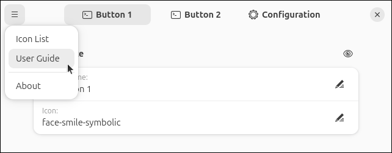

<!-- index.md -->

# Custom Command Toggle

**A GNOME extension to create custom quick toggle buttons**

Custom Command Toggle is an extension for GNOME 45+ to create fully customizable quick toggle buttons in the top panel.


---

## Key Features

- Run commands and launch scripts directly from toggle buttons.
- Use custom names and icons for buttons.
- Sync button states automatically to a command output.
- Configure startup behavior of toggle buttons.
- Check command exit code to verify command executed succussfully.
- Create always on or always off buttons.
- Assign keyboard shortcuts to buttons.
- Export and import button configurations.
- Create up to 6 custom toggle buttons.

---

## Getting Started

Open extension prefrences through the extension manager or by running:

```
gnome-extensions prefs custom-command-toggle@storageb.github.com
```

From the prefrences window, use the top-left menu for quick access to this User Guide, the Icon List, and other useful information.




    

    


