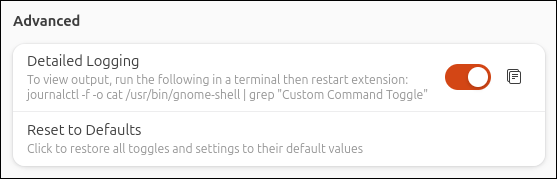

 <!-- troubleshooting.md -->

## Detailed Logging

For button configuration and setup, logging can be enabled to view extension and command outputs. 

In the Configuration tab under Advanced, enable _Detailed Logging_ to view extension and command output for toggle button and command sync setup and troubleshooting purposes. Run the following command in a terminal to view the output (click the copy button next to the toggle switch to copy the command):

```
journalctl -f -o cat /usr/bin/gnome-shell | grep "Custom Command Toggle"
```



!!! note "Use detailed logging for troubleshooting purposes only. Enabling may result in continuous excessive logging."

---

# Reset to Defaults

To fully reset the extension and restore all default settings, use the Reset to Defaults function under Confuguration Tab and Advanced.


!!! note "Caution: Reset to Defaults will remove all data and cannot be undone!"

---

# Bug reporting

To report a bug, open an issue on the GitHub page: 

[https://github.com/StorageB/custom-command-toggle/issues](https://github.com/StorageB/custom-command-toggle/issues)

Provide the output from the exported toggles.ini configuration file if required so your toggle configuration can be replicated to reproduce the issue. 
